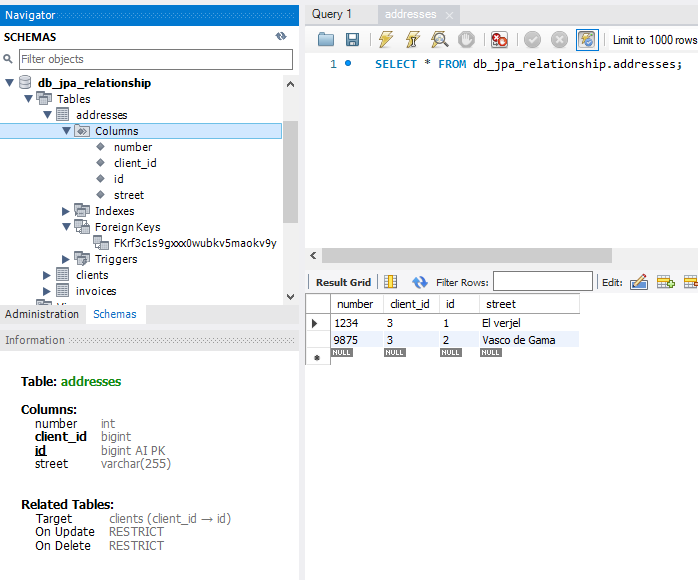

# Spring Boot Relational Mappings Example
## Descripción del proyecto
Este proyecto de Spring Boot demuestra el uso de diferentes relaciones entre entidades utilizando Spring Data JPA y MySQL. Las relaciones cubiertas son:

- One-to-One
- One-to-Many
- Many-to-One
- Many-to-Many

La aplicación se conecta a una base de datos MySQL y carga automáticamente datos iniciales desde un archivo `import.sql`.
Además, utiliza `CommandLineRunner` para ejecutar consultas y mostrar los resultados en la consola.

## Configuracion del Proyecto
### Recursos
El proyecto esta creado con las siguientes dependencias.

| Plugin                |
|-----------------------|
| MySQL JDBC Driver     | 
| Spring Data JPA       |

## Configuracion de Base de Datos
En el archivo `src/main/resources/application.properties`, configuramos la conexión a la base de datos MySQL:
```
spring.application.name=springboot-jpa
spring.datasource.url=jdbc:mysql://localhost:3306/db_jpa_relationship
spring.datasource.username=****
spring.datasource.password=****
spring.datasource.driver-class-name=com.mysql.cj.jdbc.Driver
spring.jpa.database-platform=org.hibernate.dialect.MySQLDialect
spring.jpa.show-sql=true
spring.jpa.hibernate.ddl-auto=create
```
## Archivo de Importacion de Datos
Creamos un archivo `src/main/resources/import.sql` con las primeras seis personas a insertar:
```sql
insert into clients (name, lastname) values ('Pepe', 'Napoleon');
insert into clients (name, lastname) values ('Maria', 'Cervantes');
```

## Implementacion
### Entidades 
`Client`
Creamos la clases `Client`, `Address` y `Invoice` en el paquete `com.franco.curso.springboot.jpa.springboot_jpa_relation.entities`:
* `Client`
```java
@Entity
@Table(name = "clients")
public class Client {

    @Id
    @GeneratedValue(strategy = GenerationType.IDENTITY)
    private Long id;

    private String name;
    private String lastname;

    // @JoinColumn(name = "address_id")
    // @JoinColumn(name = "client_id")// llave foranea para el cliente en la tabla address
    @OneToMany(cascade = CascadeType.ALL/* , orphanRemoval = true*/)
    @JoinTable(
            name = "tbl_clientes_to_direcciones", 
            joinColumns = @JoinColumn(name= "id_cliente"), 
            inverseJoinColumns = @JoinColumn(name="id_direcciones"),
            uniqueConstraints = @UniqueConstraint(columnNames = {"id_direcciones"}))
    private List<Address> addresses;

    @OneToMany(cascade = CascadeType.ALL, orphanRemoval = true, mappedBy="client")
    private List<Invoice> invoices;

    public Client() {
        addresses = new ArrayList<>();
        invoices = new ArrayList<>();
    }

    public Client(String name, String lastname) {
        this();
        this.name = name;
        this.lastname = lastname;
    }

    public Long getId() {
        return id;
    }

    public void setId(Long id) {
        this.id = id;
    }

    public String getName() {
        return name;
    }
    
    public void setName(String name) {
        this.name = name;
    }

    public String getLastname() {
        return lastname;
    }

    public void setLastname(String lastname) {
        this.lastname = lastname;
    }
    
    public List<Address> getAddresses() {
        return addresses;
    }

    public void setAddresses(List<Address> addresses) {
        this.addresses = addresses;
    }
    
    public List<Invoice> getInvoices() {
        return invoices;
    }

    public void setInvoices(List<Invoice> invoices) {
        this.invoices = invoices;
    }

    
    @Override
    public String toString() {
        return "{id=" + id +
                ", name=" + name +
                ", lastname=" + lastname +
                ", invoices=" + invoices +
                ", addresses=" + addresses +
                // ", clientDetails=" + clientDetails +
                 "}";
    }
}

```
* `Address`
```java
@Entity
@Table(name = "addresses")
public class Address {
    
    @Id
    @GeneratedValue(strategy = GenerationType.IDENTITY)
    private Long id;

    private String street;
    private Integer number;
    public Address() {
    }
    public Address(String street, Integer number) {
        this.street = street;
        this.number = number;
    }
    public Long getId() {
        return id;
    }
    public void setId(Long id) {
        this.id = id;
    }
    public String getStreet() {
        return street;
    }
    public void setStreet(String street) {
        this.street = street;
    }
    public Integer getNumber() {
        return number;
    }

    public void setNumber(Integer number) {
        this.number = number;
    }

    @Override
    public String toString() {
        return "{ id=" + id + ", street=" + street + ", number=" + number + "}";
    }

    @Override
    public int hashCode() {
        final int prime = 31;
        int result = 1;
        result = prime * result + ((id == null) ? 0 : id.hashCode());
        return result;
    }

    @Override
    public boolean equals(Object obj) {
        if (this == obj)
            return true;
        if (obj == null)
            return false;
        if (getClass() != obj.getClass())
            return false;
        Address other = (Address) obj;
        if (id == null) {
            if (other.id != null)
                return false;
        } else if (!id.equals(other.id))
            return false;
        return true;
    }
}
```
* `Invoice`
```java
@Entity
@Table(name = "invoices")
public class Invoice {

    @Id
    @GeneratedValue(strategy = GenerationType.IDENTITY)
    private Long id;

    private String description;
    private Long total;

    @ManyToOne
    @JoinColumn(name = "client_id")// llave foranea, por defecto tiene el mismo nombre que "name"
    private Client client;

    public Invoice() {
    }

    public Invoice(String description, Long total) {
        this.description = description;
        this.total = total;
    }

    public Long getId() {
        return id;
    }

    public void setId(Long id) {
        this.id = id;
    }

    public String getDescription() {
        return description;
    }

    public void setDescription(String description) {
        this.description = description;
    }

    public Long getTotal() {
        return total;
    }

    public void setTotal(Long total) {
        this.total = total;
    }

    public Client getClient() {
        return client;
    }

    public void setClient(Client client) {
        this.client = client;
    }

    @Override
    public String toString() {
        return "{id=" + id + ", description=" + description + ", total=" + total + "}";
    } 
}
```

### Repositorios 
`ClientRepository`
Creamos la interfaz `ClientRepository` en el paquete `com.franco.curso.springboot.jpa.springboot_jpa_relation.repositories`:
```java
public interface ClientRepository extends CrudRepository<Client, Long> {

    @Query("select c from Client c join fetch c.addresses")
    Optional<Client> findOne(Long id);
}
```
`InvoiceRepository`
Creamos la interfaz `ClientRepository` en el paquete `com.franco.curso.springboot.jpa.springboot_jpa_relation.repositories`:
```java
package com.franco.curso.springboot.jpa.springboot_jpa_relation.repositories;

import org.springframework.data.repository.CrudRepository;

import com.franco.curso.springboot.jpa.springboot_jpa_relation.entities.Invoice;

public interface InvoiceRepository extends CrudRepository<Invoice, Long>{
} 

```


### Clase Principal
Modificamos la clase principal de la aplicación para implementar `CommandLineRunner` y ejecutar consultas en la consola:
```java
@SpringBootApplication
public class SpringbootJpaRelationshipApplication implements CommandLineRunner {
	
	@Autowired
	private ClientRepository clientRepository;

	@Autowired
	private InvoiceRepository invoiceRepository;

	public static void main(String[] args) {
		SpringApplication.run(SpringbootJpaRelationshipApplication.class, args);
	}
	
	@Override
	public void run(String... args) throws Exception {
		// manyToOne();
		// manytoOneFindByIdClient();
		
		// oneToMany();
		// oneToManyFindById();
	}
}
```

# Relacion de Entidades
## ManyToOne
### Diagramas E-R Utilizando MySQL Workbench

### **Metodo `manytoOne()`**
```java
@Transactional
	public void manyToOne() {
		Client client = new Client("Franco", "Aguilar");
		clientRepository.save(client);

		Invoice invoice = new Invoice("compras de oficina", 2000L);
		invoice.setClient(client);

		Invoice invoiceDB = invoiceRepository.save(invoice);
		System.out.println(invoiceDB);
	}
```
### Visualizando en la consola

### Utilizando MySQL Workbench
Visualizando los clientes.


Visualizando la factura y su FK asignada a `cliente_id`


### **Metodo `manytoOneFindByIdClient()`**

Para agregar una factura a un cliente existente, primero obtén el cliente por su ID y luego asigna la factura al cliente:
```java
@Transactional
	public void manytoOneFindByIdClient() {

		Optional<Client> optionalClient = clientRepository.findById(1L);

		if (optionalClient.isPresent()) {
			Client client = optionalClient.orElseThrow();//si esta presente devuelve el valor

			Invoice invoice = new Invoice("compras del hogar", 4000L);
			invoice.setClient(client);

			Invoice invoiceDB = invoiceRepository.save(invoice);
			System.out.println(invoiceDB);
		}
	}
```
### Visualizando en la consola

### Utilizando MySQL Workbench
Visualizando `client`


Visualizando la factura y su FK asignada a `cliente_id`.


## OneToMany
### **Metodo `oneToMany()`**
```java
@Transactional
	private void oneToMany() {
		Client client = new Client("Fran", "Moras");
		
		Address address1 = new Address("El verjel", 1234);
		Address address2 = new Address("Vasco de Gama", 9875);

		client.getAddresses().add(address1);
		client.getAddresses().add(address2);

		clientRepository.save(client);
	
		System.out.println(client);
	}
```
### Visualizando en la consola

### Utilizando MySQL Workbench
Visualizando los clientes.


Visualizando las direcciones.


Visualizando la tabla `client_addresses`.


### Otra forma
Agregando `@JoinColumn(name = "client_id")` a la lista de direcciones en la entidad cliente, para referirse al id del cliente.
Visualizamos que ya no crea una tabla intermedia.

Crea un tercer cliente y le asigna las direcciones.


**Mysql Workbench**



### **Metodo `oneToManyFindById()`**

Para agregar direcciones a un cliente existente, primero obtén el cliente por su ID y luego asigna las direcciones al cliente:

```java
	@Transactional
	public void oneToManyFindById() {
		Optional<Client> optionalClient = clientRepository.findById(2L);
		optionalClient.ifPresent(client -> {
			Address address1 = new Address("Guillermo Prescott", 232);
			Address address2 = new Address("Julia Codesido", 101);
			
			// List<Address> addresses = new ArrayList<>();
			// addresses.add(address1);
			// addresses.add(address2);

			// client.setAddresses(addresses);
			client.setAddresses(Arrays.asList(address1,address2));

			clientRepository.save(client);  

			System.out.println(client); 
		});
	}
```
Visualizando en la consola


Visualizando en MySQL Workbench.


**Otra forma**

creando una tabla intermedia con las dos `Foreign Key`
Agregamos la anotacion `@JoinTable` en direcciones de la entidad `Client`.

Visualizando en la consola


Visualizando en MySQL Workbench.

